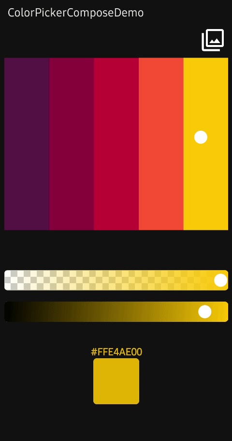
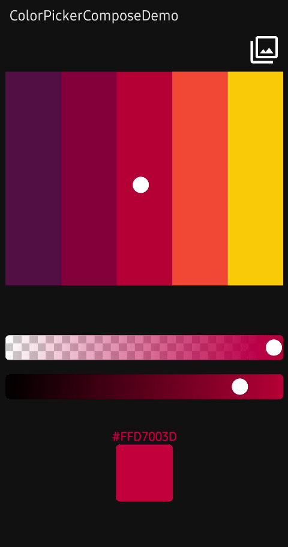

<br><br>

<p align="center">
  <a href="https://devlibrary.withgoogle.com/products/android/repos/skydoves-colorpicker-compose"></a><br>
  <a href="https://opensource.org/licenses/Apache-2.0"></a>
  <a href="https://android-arsenal.com/api?level=21"></a>
  <a href="https://github.com/skydoves/colorpicker-compose/actions/workflows/android.yml"></a>
    <a href="https://androidweekly.net/issues/issue-509"></a>  
  <a href="https://github.com/skydoves"></a>
</p><br>

<p align="center">
🎨 Jetpack Compose color picker library that allows you to get colors from any images like gallery pictures by tapping on the desired color. 
Also, it supports brightness and alpha slider, which can adjust your ARGB factors.
</p>

## Preview
<p align="center">


</p>

## Download
[](https://search.maven.org/search?q=g:%22com.github.skydoves%22%20AND%20a:%22colorpicker-compose%22)

### Gradle
Add the dependency below to your **module**'s `build.gradle.kts` file:

```gradle
dependencies {
    implementation("com.github.skydoves:colorpicker-compose:1.0.4")
}
```

## SNAPSHOT 

<details>
 <summary>See how to import the snapshot</summary>

### Including the SNAPSHOT
Snapshots of the current development version of ColorPicker-Compose are available, which track [the latest versions](https://oss.sonatype.org/content/repositories/snapshots/com/github/skydoves/colorpicker-compose/).

To import snapshot versions on your project, add the code snippet below on your gradle file:

```Gradle
repositories {
   maven(url="https://oss.sonatype.org/content/repositories/snapshots/")
}
```

Next, add the dependency below to your **module**'s `build.gradle.kts` file:

```gradle
dependencies {
    implementation("com.github.skydoves:colorpicker-compose:1.0.5-SNAPSHOT")
}
```

</details>

## Usage

First, you should initialize `ColorPickerController`, which allows you to control color pickers and all subcomponents.

```kotlin
val controller = rememberColorPickerController()
```

Next, you can implement a color picker with the `ImageColorPicker` composable function.

```kotlin
ImageColorPicker(
    modifier = Modifier.fillMaxSize(),
    paletteImageBitmap = ImageBitmap.imageResource(R.drawable.palettebar),
    controller = controller
)
```


### ImageColorPicker

**ImageColorPicker** allows you to get colors from any images such as gallery pictures or drawable resources by tapping on the desired color. 
It interacts with the `ColorPickerController` to control the color picker and other components. You can use the `ImageColorPicker` as the following example:

```kotlin
ImageColorPicker(
    modifier = Modifier
        .fillMaxWidth()
        .height(450.dp)
        .padding(10.dp),
    controller = controller,
    paletteImageBitmap = ImageBitmap.imageResource(R.drawable.palettebar),
    paletteContentScale = PaletteContentScale.FIT,
    onColorChanged = { colorEnvelope: ColorEnvelope ->
        // do something
    }
)
```

With the [modernstorage](https://github.com/google/modernstorage)'s [Photo Picker](https://google.github.io/modernstorage/photopicker/), you can set an desired image as the palette like the below:

```kotlin
val context = LocalContext.current
val photoPicker =
    rememberLauncherForActivityResult(PhotoPicker()) { uris ->
        val uri = uris.firstOrNull() ?: return@rememberLauncherForActivityResult

        val bitmap = if (Build.VERSION.SDK_INT >= Build.VERSION_CODES.P) {
            ImageDecoder.decodeBitmap(ImageDecoder.createSource(context.contentResolver, uri))
        } else {
            MediaStore.Images.Media.getBitmap(context.contentResolver, uri)
        }

        controller.setPaletteImageBitmap(bitmap.asImageBitmap())
    }
```

As you can see the above, you can set the palette with the `setPaletteImageBitmap` function of the controller.

#### PaletteContentScale

You can adjust your palette's image scale with the `setPaletteContentScale` function of the controller as the below:

```kotlin
controller.setPaletteContentScale(PaletteContentScale.FIT) // scale the image to fit width and height.
controller.setPaletteContentScale(PaletteContentScale.CROP) // center crop the image.
```


### HsvColorPicker

HsvColorPicker allows you to get colors from HSV color palette by tapping on the desired color.
It interacts with the `ColorPickerController` to control the color picker and other components. You can use the `HsvColorPicker` as the following example:

```kotlin
HsvColorPicker(
    modifier = Modifier
        .fillMaxWidth()
        .height(450.dp)
        .padding(10.dp),
    controller = controller,
    onColorChanged = { colorEnvelope: ColorEnvelope ->
        // do something
    }
)
```

To initialize the color picker with a specific color, pass the color to the `initialColor` argument. Initial color is white by default.

> **Note**: If you use `HsvColorPicker`, you can not set the palette and content scale with the `setPaletteImageBitmap` and `setPaletteContentScale` functions.

### ColorEnvelope

**ColorEnvelope** is a data transfer object that includes updated color factors. If you pass the **onColorChanged** lambda function to the `ImageColorPicker` or `HsvColorPicker`, the lambda receives **ColorEnvelope**.
**ColorEnvelope** includes the following properties:

```kotlin
onColorChanged = { colorEnvelope: ColorEnvelope ->
    val color: Color = colorEnvelope.color // ARGB color value.
    val hexCode: String = colorEnvelope.hexCode // Color hex code, which represents color value.
    val fromUser: Boolean = colorEnvelope.fromUser // Represents this event is triggered by user or not.
}
```

### ColorPickerController

**ColorPickerController** interacts with color pickers and it allows you to control the all subcomponents.

#### Custom Wheel

You can customize the wheel with the following functions:

```kotlin
.setWheelRadius(40.dp) // set the radius size of the wheel.
.setWheelColor(Color.Blue) // set the color of the wheel.
.setWheelAlpha(0.5f) // set the transparency of the wheel.
.setWheelImageBitmap(imageBitmap) // set the wheel image with your custom ImageBitmap.
```

#### Select Points

You can select specific points with the functions below:

```kotlin
.selectByCoordinate(x = 100f, y = 100f, fromUser = false) // select x = 100, y = 100.
.selectCenter(fromUser = false) // select center of the palette.
```

#### Debounce

You can set the debounce duration, which decides to invoke the color listener from the last tapping. Debounce can be useful to reduce overhead. For example, communicating with IoT devices or relevant works that require heavy operations.

```kotlin
.setDebounceDuration(300L)
```

#### Enable and Disable

You can enable or disable your color picker with the below function:

```kotlin
.setEnabled(false)
```



### AlphaSlider

**AlphaSlider** allows you to adjust the alpha value of the selected color from color pickers. 
**AlphaSlider** needs to be tied to the `ColorPickerController`, and the value changes will be assembled with the selected color factors.
You can implement **AlphaSlider** as the following example:

```kotlin
AlphaSlider(
    modifier = Modifier
        .fillMaxWidth()
        .padding(10.dp)
        .height(35.dp),
    controller = controller,
)
```

You can customize the border of the sider with the following parameters:

```kotlin
AlphaSlider(
    borderRadius = 6.dp,
    borderSize = 5.dp,
    borderColor = Color.LightGray,
    ..
)
```

You can customize the wheel of the sider with the following parameters:

```kotlin
AlphaSlider(
    wheelRadius = 30.dp,
    wheelColor = Color.White,
    wheelPaint = Paint().apply { color = wheelColor },
    wheelImageBitmap = ImageBitmap.imageResource(R.drawable.wheel),
    ..
)
```

Also, you can customize tiles of the background with the following parameters:

```kotlin
AlphaSlider(
    tileOddColor = Color.White,
    tileEvenColor = Color.LightGray,
    tileSize = 30.dp,
    ..
)
```



### BrightnessSlider

**BrightnessSlider** allows you to adjust the brightness value of the selected color from color pickers. 
**BrightnessSlider** needs to be tied to the `ColorPickerController`, and the value changes will be assembled with the selected color factors.
You can implement **BrightnessSlider** as the following example:

```kotlin
BrightnessSlider(
    modifier = Modifier
        .fillMaxWidth()
        .padding(10.dp)
        .height(35.dp),
    controller = controller,
)
```

You can customize the wheel of the sider with the following parameters:

```kotlin
BrightnessSlider(
    wheelRadius = 30.dp,
    wheelColor = Color.White,
    wheelPaint = Paint().apply { color = wheelColor },
    wheelImageBitmap = ImageBitmap.imageResource(R.drawable.wheel),
    ..
)
```

### AlphaTile

**AlphaTile** allows you to display ARGB colors including transparency with tiles.

```kotlin
AlphaTile(
    modifier = Modifier
        .size(80.dp)
        .clip(RoundedCornerShape(6.dp)),
    controller = controller
)
```

Also, you can customize tiles of the background with the following parameters:

```kotlin
AlphaTile(
    tileOddColor = Color.White,
    tileEvenColor = Color.LightGray,
    tileSize = 30.dp,
    ..
)
```

## Find this repository useful? :heart:
Support it by joining __[stargazers](https://github.com/skydoves/colorpicker-compose/stargazers)__ for this repository. :star: <br>
Also, __[follow me](https://github.com/skydoves)__ on GitHub for my next creations! 🤩

# License
```xml
Designed and developed by 2022 skydoves (Jaewoong Eum)

Licensed under the Apache License, Version 2.0 (the "License");
you may not use this file except in compliance with the License.
You may obtain a copy of the License at

   http://www.apache.org/licenses/LICENSE-2.0

Unless required by applicable law or agreed to in writing, software
distributed under the License is distributed on an "AS IS" BASIS,
WITHOUT WARRANTIES OR CONDITIONS OF ANY KIND, either express or implied.
See the License for the specific language governing permissions and
limitations under the License.
```
